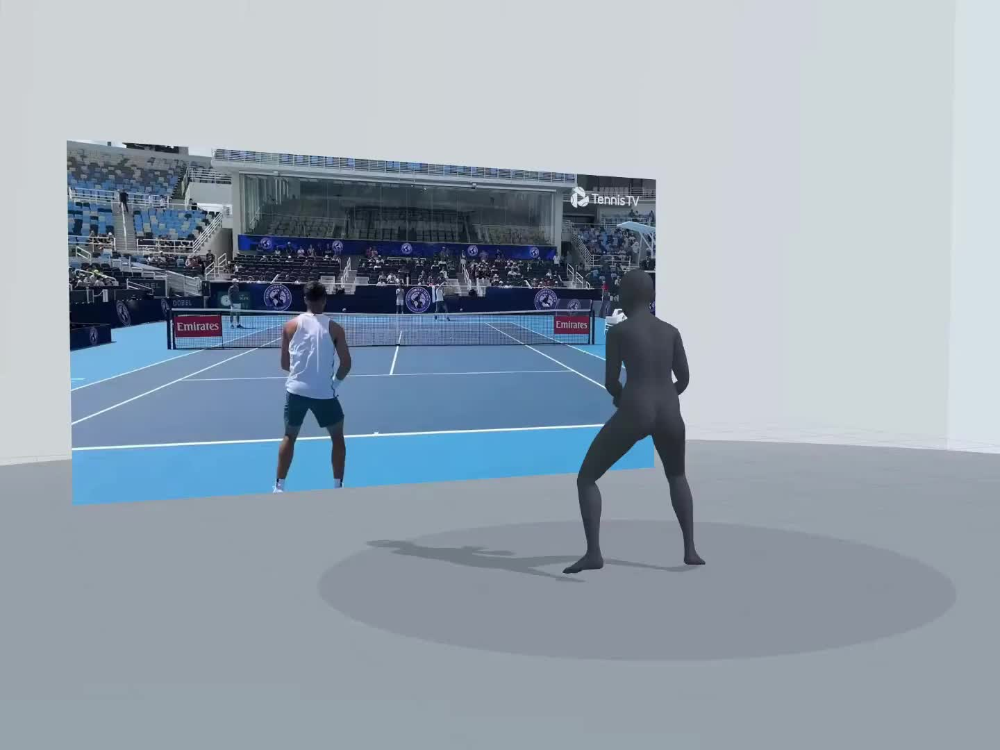
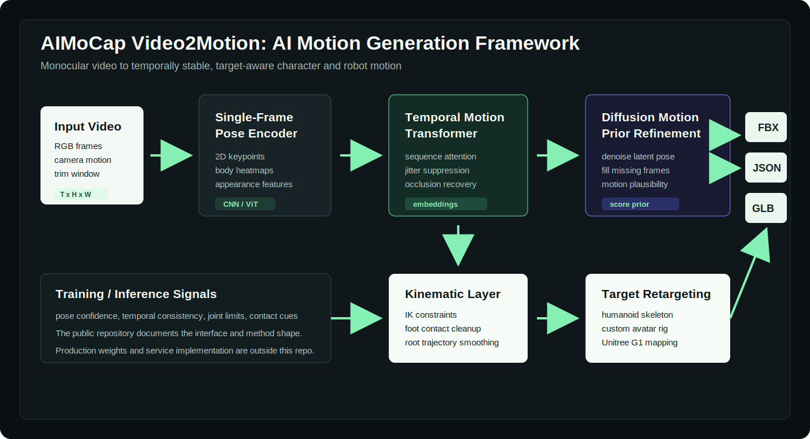
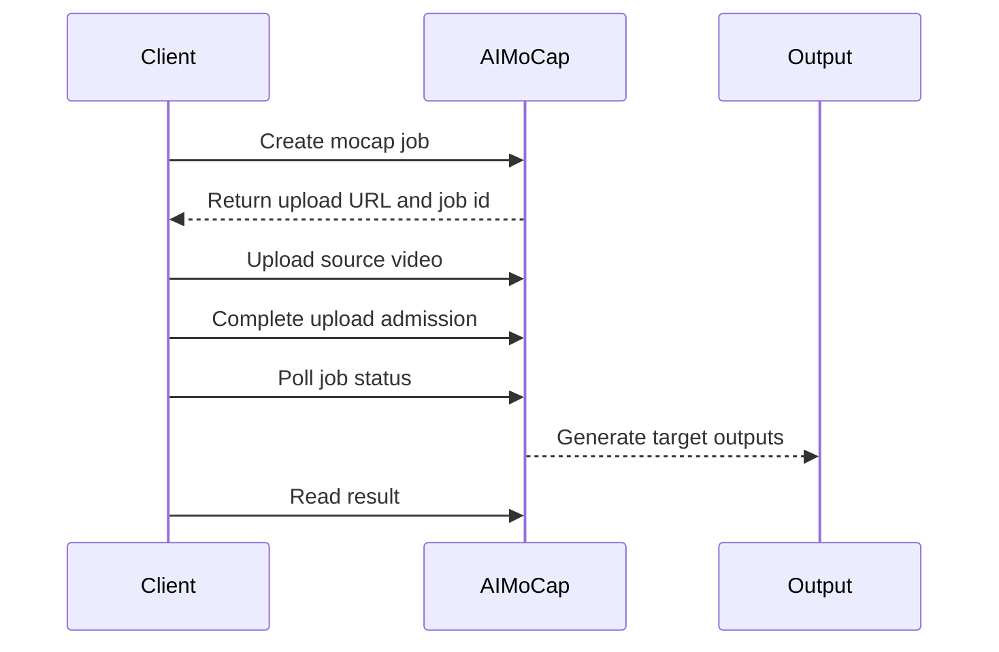

# AIMoCap Video2Motion

> AI video mocap from a short monocular clip to animation-ready FBX and
> Unitree G1 robot motion output.

<p align="center">
  <a href="https://animate-x.github.io/aimocap"><b>Project Page</b></a>
  &nbsp;|&nbsp;
  <a href="https://huggingface.co/spaces/animtex/AIMoCap"><b>HF Space</b></a>
  &nbsp;|&nbsp;
  <a href="https://aimocap.net"><b>AIMoCap Studio</b></a>
  &nbsp;|&nbsp;
  <a href="https://aimocap.net/docs/api-overview"><b>API Docs</b></a>
</p>

<p align="center">
  
</p>

## Abstract

AIMoCap Video2Motion is a public entry repository for a browser-first video
motion capture workflow. Given a short monocular video, the workflow targets
motion artifacts that can be reviewed and handed off to animation or robotics
pipelines: humanoid FBX for character workflows and Unitree G1 motion JSON for
robot-oriented review.

This repository is intentionally documentation-first. It provides a technical
overview, public API examples, output format notes, demo links, and release
roadmap while keeping service implementation and private model assets outside
the public release.

## Introduction

Video-based motion capture has become an attractive alternative to marker-based
capture because it lowers the input requirement to ordinary RGB video. However,
most pose-estimation demos stop at keypoints or frame-wise reconstruction, which
leaves downstream users with temporal jitter, missing-frame artifacts, retarget
ambiguity, and manual export cleanup.

AIMoCap Video2Motion frames the problem as target-aware motion generation. The
system first collects per-frame pose evidence from a monocular clip, then uses
sequence models and motion priors to recover stable full-body motion before
retargeting the result to character animation and robot motion formats.

## News

- **2026-06**: Public project page and README report released.
- **2026-06**: Public Python API example and output format notes added.
- **2026-06**: Unitree G1 motion output documented as a first public robot target.

## Key Features

- **Markerless video mocap**: start from a monocular video clip without a suit,
  optical markers, or a capture stage.
- **Target-aware motion delivery**: request humanoid FBX, Unitree G1 robot
  motion JSON, or a multi-target job from the same source clip.
- **Review-first workflow**: trim, submit, inspect visual output, and download
  files after the result is ready.
- **Asynchronous public API shape**: create a job, upload the clip, poll status,
  and retrieve target-specific outputs.
- **Research-style project page**: inspect demos, comparison tables, and the
  high-level method before opening AIMoCap Studio.

## Technical Framework

<p align="center">
  
</p>

AIMoCap is presented as a modular video-to-motion generation pipeline. The
public framework is organized around single-frame pose evidence, sequence-level
motion modeling, generative motion refinement, and target-specific retargeting:

| Module | Role | Technical Intuition |
| --- | --- | --- |
| Single-frame pose encoder | Extract frame-local body evidence | CNN/ViT-style pose features, 2D keypoints, confidence maps |
| Temporal motion transformer | Model cross-frame consistency | Self-attention over motion embeddings for jitter suppression and occlusion recovery |
| Diffusion motion prior | Refine plausible full-body motion | Denoising-style latent motion repair for missing or noisy frames |
| Kinematic constraint layer | Improve physical consistency | joint limits, root trajectory smoothing, foot contact cleanup |
| Target retargeting head | Produce downstream files | humanoid FBX, custom avatar motion, Unitree G1 motion JSON |

The public repository documents the interface and output behavior of the
workflow rather than the production implementation.

## Method Overview

The method can be read as a two-level reconstruction problem: frame-local
estimation provides noisy but dense evidence, while sequence-level models
recover temporally coherent motion suitable for export.

1. **Frame evidence extraction**: each RGB frame is encoded into pose evidence
   such as 2D joints, body heatmaps, subject appearance features, and confidence
   estimates.
2. **Temporal embedding**: per-frame observations are assembled into sequence
   embeddings, allowing the model to reason across adjacent and long-range frames.
3. **Transformer stabilization**: a temporal Transformer suppresses jitter,
   propagates reliable pose cues through occlusions, and regularizes root/body
   trajectories.
4. **Diffusion prior refinement**: a generative motion prior denoises latent
   pose sequences and repairs implausible frames under learned motion dynamics.
5. **Kinematic cleanup**: contact-aware constraints, joint limit checks, and IK
   corrections improve export stability for character and robot targets.
6. **Target adaptation**: the target head retargets the normalized motion to
   humanoid FBX, custom avatar rigs, or Unitree G1 motion JSON.

In public API terms, the workflow remains asynchronous: create a job, upload the
clip, poll status, and retrieve preview plus target-specific outputs.

## Algorithmic Notes

The following abstractions are useful when comparing AIMoCap with pose-only
repositories:

| Component | Pose-only baseline | AIMoCap-style motion pipeline |
| --- | --- | --- |
| Observation | independent frames | frame features plus sequence context |
| Temporal reasoning | smoothing or tracking after pose estimation | Transformer over motion embeddings |
| Motion prior | often absent | diffusion-style denoising prior |
| Contact handling | usually manual cleanup | contact-aware kinematic correction |
| Output representation | 2D/3D keypoints | exportable FBX and robot motion tracks |

This repository does not publish model weights or training code. It documents
the public interface, expected outputs, and high-level algorithmic design.

## Output Targets

| Target | Public ID | Output | Typical Use |
| --- | --- | --- | --- |
| Humanoid animation | `default` | FBX | DCC review, cleanup, Unity or Unreal import |
| Unitree G1 | `unitree_g1` | Motion JSON | Robot motion collection and simulation review |
| Custom avatar | planned public API | FBX | Character-specific retargeting |

See [examples/output-formats](examples/output-formats) for simplified output
schemas and field notes.

## Demo Results

| Scenario | Input | Output | Entry |
| --- | --- | --- | --- |
| Video to humanoid motion | Short monocular clip | FBX animation | [Project page](https://animate-x.github.io/aimocap) |
| Video to Unitree G1 motion | Same clip | Robot motion JSON | [HF Space](https://huggingface.co/spaces/animtex/AIMoCap) |
| Multi-target review | One submitted job | Target-specific outputs | [AIMoCap Studio](https://aimocap.net) |

## Technical Comparison

| Capability | Pose estimation repos | Traditional mocap | Generic video tools | AIMoCap |
| --- | --- | --- | --- | --- |
| Monocular video input | Yes | No | Yes | Yes |
| Markerless capture | Yes | No | Usually | Yes |
| Animation-ready FBX | Usually no | Yes | Usually no | Yes |
| Robot motion target | No | No | No | Unitree G1 |
| Browser review workflow | Limited | No | Sometimes | Yes |
| Public API flow | Varies | No | Varies | Yes |
| Multi-target export from one clip | Usually no | Workflow dependent | Usually no | Yes |

## Public API Overview

The API follows an asynchronous job lifecycle:



Minimal request shape:

```json
{
  "title": "tennis-motion",
  "sourceFilename": "tennis.mp4",
  "targetIds": ["default", "unitree_g1"],
  "exportFps": 30
}
```

Minimal result shape:

```json
{
  "job": {
    "id": "job_example",
    "status": "completed"
  },
  "previewVideoUrl": "https://aimocap.net/example-preview.mp4",
  "outputs": [
    {
      "targetId": "default",
      "resultType": "fbx",
      "fbxUrl": "https://aimocap.net/example-motion.fbx"
    },
    {
      "targetId": "unitree_g1",
      "resultType": "robot_motion_json",
      "motionJsonUrl": "https://aimocap.net/example-g1-motion.json"
    }
  ]
}
```

See [examples/python](examples/python) for an end-to-end Python example.

## Repository Layout

```text
.
|-- README.md
|-- assets/
|   |-- hero-video-poster.jpg
|   |-- feature-video-motion-poster.jpg
|   |-- feature-video-robot-poster.jpg
|   `-- technical-framework.svg
|-- docs/
|   |-- api-quickstart.md
|   |-- hf-space.md
|   |-- open-source-roadmap.md
|   `-- workflow.md
`-- examples/
    |-- output-formats/
    `-- python/
```

## Repository Scope

This repository contains public documentation, examples, output format notes,
and demo links. It is intentionally scoped as an open entry repository.

Included here:

- technical overview and public workflow description
- public API examples with placeholder keys
- simplified output format notes
- demo links and project-page references

Not included here:

- hosted service implementation
- production motion processing code
- account or billing code
- private model assets
- non-public service configuration

## Limitations

- The public examples describe the API shape and expected workflow; exact
  production availability can vary by release.
- Output quality depends on the source clip. Clear body visibility, stable
  framing, and short motion segments are recommended.
- Robot motion output is intended for review and downstream validation before
  use in physical systems.

## Citation-Style Reference

If you discuss AIMoCap Video2Motion in a technical note, use:

```bibtex
@misc{aimocap2026video2motion,
  title  = {AIMoCap Video2Motion: AI Video Mocap for Animation and Robot Motion},
  author = {AIMoCap},
  year   = {2026},
  url    = {https://animate-x.github.io/aimocap}
}
```

## Links

- Project page: https://animate-x.github.io/aimocap
- Website: https://aimocap.net
- API docs: https://aimocap.net/docs/api-overview
- Output formats: [examples/output-formats](examples/output-formats)
- Roadmap: [docs/open-source-roadmap.md](docs/open-source-roadmap.md)
