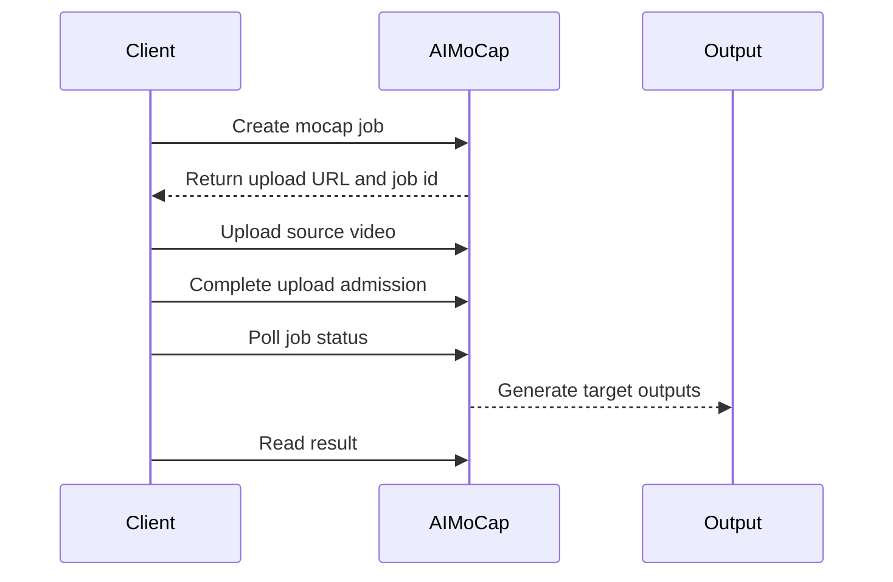

# AIMoCap Video2Motion

> AI video mocap from a short monocular clip to animation-ready FBX and Unitree
> G1 robot motion output.

<p align="center">
  <a href="https://animate-x.github.io/aimocap"><b>Project Page</b></a>
  &nbsp;|&nbsp;
  <a href="https://huggingface.co/spaces/animate-x/aimocap"><b>HF Space</b></a>
  &nbsp;|&nbsp;
  <a href="https://aimocap.net"><b>AIMoCap Studio</b></a>
  &nbsp;|&nbsp;
  <a href="https://aimocap.net/docs/api-overview"><b>API Docs</b></a>
</p>

<p align="center">
  
</p>

## Introduction

AIMoCap Video2Motion is a public entry point for a browser-first motion capture
workflow. It focuses on converting a clean short video into motion artifacts
that can be reviewed and handed off to animation or robotics pipelines.

Unlike pose-only demos that stop at keypoints, AIMoCap is designed around
target-aware motion delivery: humanoid FBX for character animation and Unitree
G1 motion JSON for robot-oriented review.

## Key Features

- **Markerless video mocap**: start from monocular video without a suit or
  optical marker setup.
- **Target-aware output**: request humanoid FBX, Unitree G1 robot motion, or a
  multi-target job from the same clip.
- **Review-first workflow**: trim, submit, inspect visual output, and download
  files only after the result is ready.
- **Public API example**: use the asynchronous job flow from Python or other
  production tools.
- **Project-page demo path**: use the research-style page and HF Space before
  opening AIMoCap Studio.

## Technical Framework

<p align="center">
  
</p>

The public workflow is organized around four stages:

1. **Source preparation**: upload a short video, trim the motion range, and
   select target outputs.
2. **Motion reconstruction**: estimate full-body motion from the selected clip
   and normalize it into a target-neutral motion representation.
3. **Target adaptation**: map reconstructed motion into humanoid animation or
   robot motion formats.
4. **Review and export**: inspect preview output and download target-specific
   files.

## Output Targets

| Target | Public ID | Output | Typical Use |
| --- | --- | --- | --- |
| Humanoid animation | `default` | FBX | DCC review, cleanup, game engine import |
| Unitree G1 | `unitree_g1` | robot motion JSON | Robot motion collection and simulation review |
| Custom avatar | planned public API | FBX | Character-specific retargeting |

## Demo Results

| Scenario | Input | Output | Entry |
| --- | --- | --- | --- |
| Video to humanoid motion | Short monocular clip | FBX animation | [Project page](https://animate-x.github.io/aimocap) |
| Video to Unitree G1 motion | Same clip | Robot motion JSON | [HF Space](https://huggingface.co/spaces/animate-x/aimocap) |
| Multi-target review | One submitted job | Target-specific outputs | [AIMoCap Studio](https://aimocap.net) |

## Technical Comparison

| Capability | Pose estimation repos | Traditional mocap | Generic video tools | AIMoCap |
| --- | --- | --- | --- | --- |
| Monocular video input | Yes | No | Yes | Yes |
| Markerless capture | Yes | No | Usually | Yes |
| Animation-ready FBX | Usually no | Yes | Usually no | Yes |
| Robot motion target | No | No | No | Unitree G1 |
| Browser review workflow | Limited | No | Sometimes | Yes |
| Public API flow | Varies | No | Varies | Yes |

## Public API Overview

The API follows an asynchronous job lifecycle:



Minimal request shape:

```json
{
  "title": "tennis-motion",
  "sourceFilename": "tennis.mp4",
  "targetIds": ["default", "unitree_g1"],
  "exportFps": 30
}
```

See [examples/python](examples/python) for an end-to-end Python example.

## Repository Scope

This repository contains public documentation, examples, output format notes,
and demo links. It is intentionally scoped as an open entry repository.

Not included here:

- hosted service implementation
- production motion processing code
- account, billing, or deployment code
- private model assets
- non-public service configuration

## Citation-Style Reference

If you discuss AIMoCap Video2Motion in a technical note, use:

```bibtex
@misc{aimocap2026video2motion,
  title  = {AIMoCap Video2Motion: AI Video Mocap for Animation and Robot Motion},
  author = {AIMoCap},
  year   = {2026},
  url    = {https://animate-x.github.io/aimocap}
}
```

## Links

- Project page: https://animate-x.github.io/aimocap
- Website: https://aimocap.net
- API docs: https://aimocap.net/docs/api-overview
- Output formats: [examples/output-formats](examples/output-formats)
- Roadmap: [docs/open-source-roadmap.md](docs/open-source-roadmap.md)
